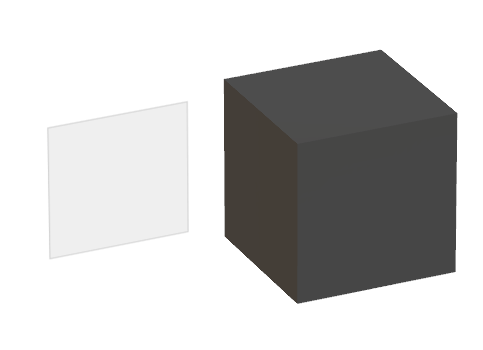

# Wherobots Visual Studio

Welcome to Wherobots Visual Studio (WVS), the fictitious geospatial visualization studio for building spatial workflows
and visualizing spatial data on WherobotsDB.

## What can you do with WVS?

Using the proprietary Dimensional Data Depiction Engine (3DE) ™️, Wherobots showcases the value in your flat data sources by creating engaging geospatial images that capture your insights.

## Get Started

You can use WVS from the command line or from the browser.

  <pre><code id="code-sample">
    // Your code here
    console.log('Hello, World!');
  </code></pre>
  <button onclick="copyToClipboard()" style="position: absolute; top: 0; right: 0; padding: 5px 10px; background-color: #007bff; color: white; border: none; border-radius: 5px; cursor: pointer;">
    <svg xmlns="http://www.w3.org/2000/svg" width="16" height="16" fill="currentColor" class="bi bi-clipboard" viewBox="0 0 16 16">
      <path d="M10 1.5H6a.5.5 0 0 0-.5.5v1H4a2 2 0 0 0-2 2v8a2 2 0 0 0 2 2h8a2 2 0 0 0 2-2V5a2 2 0 0 0-2-2h-1.5v-1a.5.5 0 0 0-.5-.5zM6 2h4v1H6V2z"/>
      <path d="M4.5 3h7a1 1 0 0 1 1 1v8a1 1 0 0 1-1 1h-7a1 1 0 0 1-1-1V4a1 1 0 0 1 1-1z"/>
    </svg>
  </button>

  <a href="https://example.com" class="button" style="display: inline-block; padding: 10px 20px; font-size: 16px; color: white; background-color: #007bff; border-radius: 5px; text-decoration: none; on-click: copyToClipboard;">WVS CLI</a>

 

  <a href="https://example.com" class="button" style="display: inline-block; padding: 10px 20px; font-size: 16px; color: white; background-color: #007bff; border-radius: 5px; text-decoration: none;">WVS Online</a>

<nav style="background-color: #333; padding: 10px;">
  <ul style="list-style-type: none; margin: 0; padding: 0; overflow: hidden;">
    <li style="float: left;"><a href="/" style="display: block; color: white; text-align: center; padding: 14px 16px; text-decoration: none; transition: background-color 0.3s;">Get Started</a></li>
    <li style="float: left;"><a href="/about" style="display: block; color: white; text-align: center; padding: 14px 16px; text-decoration: none; transition: background-color 0.3s;">Known Issues & Roadmap</a></li>
  </ul>
</nav>

